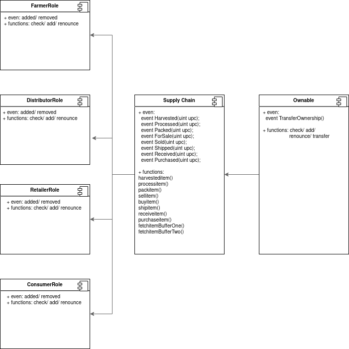

# Ethereum_Dapp_for_Tracking_Items_through_Supply_Chain

This repository containts an Ethereum DApp that demonstrates a Supply Chain flow between a Seller and Buyer. The user story is similar to any commonly used supply chain process. A Seller can add items to the inventory system stored in the blockchain. A Buyer can purchase such items from the inventory system. Additionally a Seller can mark an item as Shipped, and similarly a Buyer can mark an item as Received.

## UML:

## reference required:

    - Specify the Truffle version and OpenZeppelin version used in the project:
        - Truffle v5.1.65
        - Solidity v0.5.16 (solc-js)
        - Node v10.19.0
        - Web3.js v1.3.4
        - truffle-hdwallet-provider@1.0.17
    - "SupplyChain transaction hash" on the Rinkeby Network: 0xd82b173ab3733f67a601509ec9f69896ebf6f61b1d9f6d623e2581f1a343b79a
    - "SupplyChain contract address" on the Rinkeby Network: 0x46878D204916e98FEa9b9D2287085B11991fB9eA

## running step:

    - Open 1st terminal:
        - git clone 'this project'
        - cd project-6
        - sudo truffle migrate --reset --network rinkeby
    - open a seperate terminal:
        - npm run dev
    - open http://localhost:3000